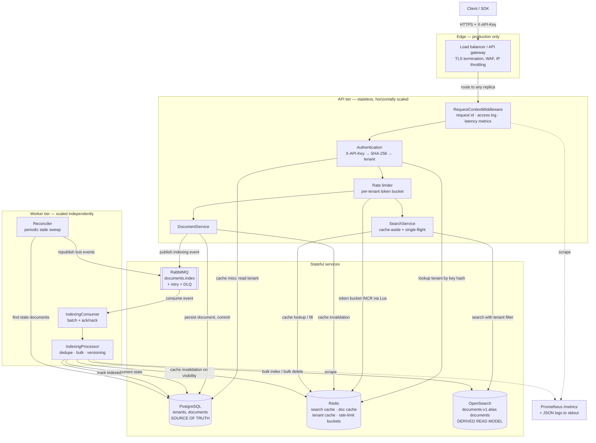
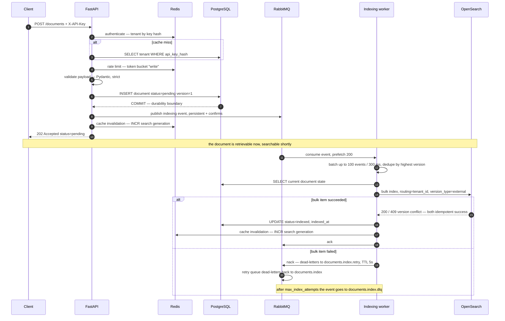
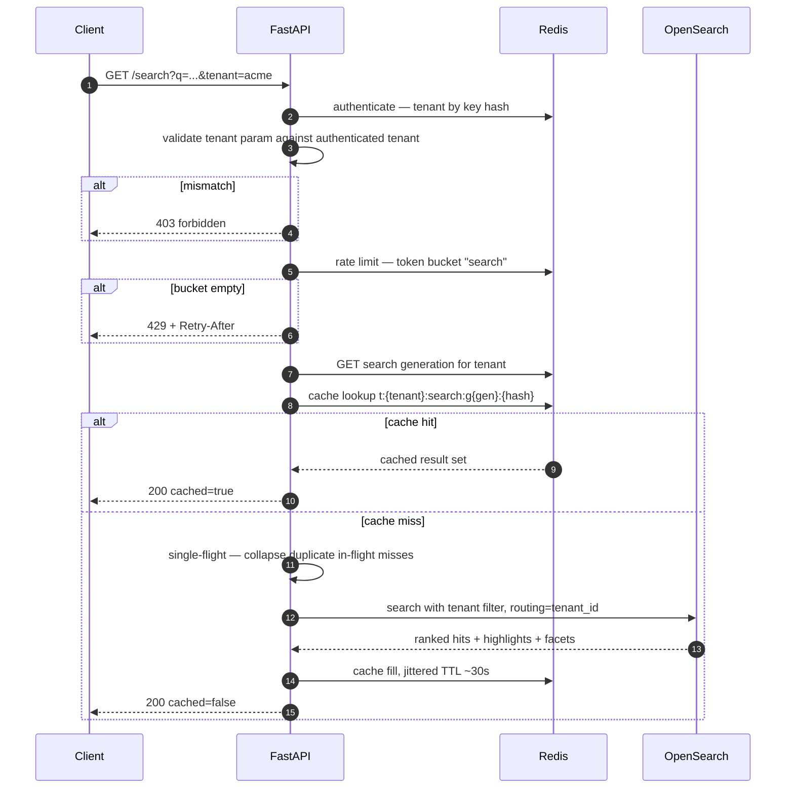
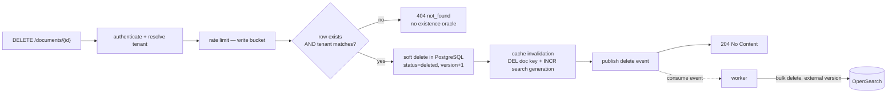
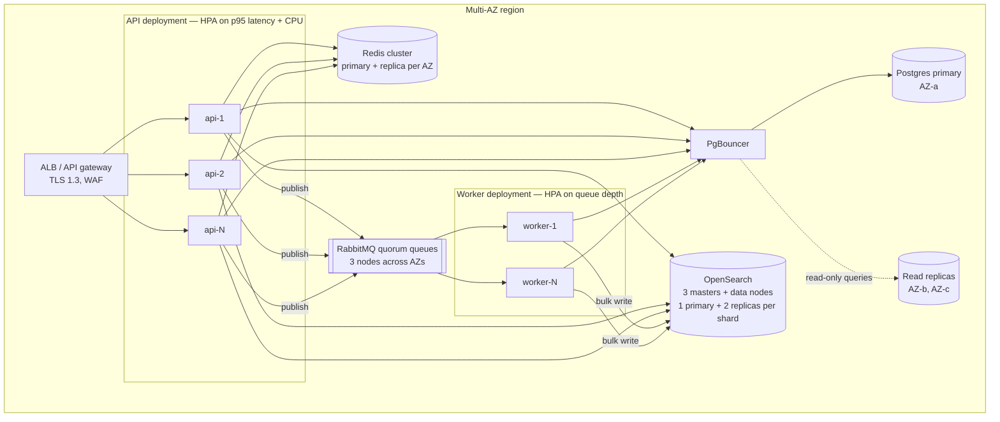

# Distributed Document Search Service

A multi-tenant document search service designed for 10M+ documents, 1000+ concurrent searches/sec and a sub-500 ms p95, implemented as a working prototype with the same component boundaries the production system would have.

**Stack:** Python 3.12 · FastAPI · PostgreSQL 16 · OpenSearch 2.18 · Redis 7 · RabbitMQ 3.13 · Docker Compose

| Document | Contents |
|---|---|
| This README | Setup, API reference, curl examples, diagrams, configuration |
| [`docs/SUBMISSION.md`](docs/SUBMISSION.md) | Architecture design, production-readiness analysis, experience showcase, AI-tool note |
| [`docs/REQUIREMENTS_MATRIX.md`](docs/REQUIREMENTS_MATRIX.md) | Requirement → implementation → verification matrix |
| [`docs/SELF_AUDIT.md`](docs/SELF_AUDIT.md) | Compliance audit and diagram/code/doc consistency check |
| [`docs/REVIEWER_NOTES.md`](docs/REVIEWER_NOTES.md) | Self-review from the interviewer's perspective |

---

## 1. Overview

The service indexes tenant-scoped documents and serves relevance-ranked full-text search over them.

Three ideas carry the design:

1. **PostgreSQL is the source of truth; OpenSearch is a derived read model.** Writes are durable the moment Postgres commits. Search visibility follows asynchronously and is reconciled if the pipeline drops an event.
2. **Tenant identity is derived from the credential, never from the request.** The `?tenant=` parameter in the required API contract is accepted, but only cross-checked against the authenticated principal — a mismatch is a 403, not a silent re-scope.
3. **Every dependency has a defined failure behaviour.** Redis down → degraded latency. RabbitMQ down → deferred indexing, writes still succeed. OpenSearch down → search returns 503 behind a circuit breaker while reads and writes continue.

## 2. Requirements addressed

| Target | How the design meets it |
|---|---|
| 10M+ documents | OpenSearch sharding with `_routing = tenant_id`; Postgres indexed on tenant access paths, partition strategy documented |
| Multi-tenant | Tenant registry in Postgres; filter applied inside the engine query; tenant-scoped cache keys and rate-limit buckets |
| Full-text + relevance | OpenSearch BM25 over a custom analyzer, `title^3` boost, highlighting, fuzzy and faceted search |
| <500 ms p95 | Single-shard routed queries, short-TTL Redis result cache, single-flight coalescing, capped `track_total_hits`, bounded page size |
| 1000+ concurrent searches/sec | Stateless async API scaled horizontally behind a load balancer; read replicas in OpenSearch; cache absorbs repeat traffic |
| Tenant isolation & security | Hashed API keys, server-derived tenant, 404-not-403 on cross-tenant access, parameterised queries, no stack traces in responses |
| Horizontal scalability | No in-process state; API and worker scale independently |
| Fault tolerance | Retries with jittered backoff, circuit breaker, retry queue + DLQ, reconciliation sweep, graceful degradation |

## 3. Architecture

### 3.1 High-level system architecture



Everything above is implemented and wired in `docker-compose.yml`, **except** the load balancer / API gateway box, which is explicitly marked *production only*.

### 3.2 Indexing data flow



### 3.3 Search data flow



Failure paths: if Redis raises, every cache call is a logged no-op and the query proceeds against OpenSearch. If OpenSearch fails repeatedly the circuit breaker opens and search returns `503 dependency_unavailable` immediately instead of queueing threads behind a dead cluster.

### 3.4 Deletion data flow



### 3.5 Deployment and scaling



## 4. Technology choices

Each choice lists what it owns, why it beat the alternative, and how it serves the SLA.

### OpenSearch — search engine
**Owns:** the inverted index, BM25 relevance, highlighting, facets, tenant-filtered retrieval.
**Why:** purpose-built for exactly the stated workload — 10M+ documents, relevance ranking, sub-second queries, horizontal sharding, replica-based read scaling.
**Why not PostgreSQL full-text search:** `tsvector` + GIN is excellent up to a few million rows on one box, but relevance tuning is crude, highlighting and faceting are manual, and scaling reads means scaling the same database that carries the write load. Coupling search traffic to the source of truth is the thing this architecture is specifically trying to avoid.
**Why not Elasticsearch:** functionally equivalent for this workload; OpenSearch is Apache-2.0 and avoids the SSPL/licensing question. The adapter is behind a port, so swapping back is a single class.
**Scalability:** shards scale the corpus, replicas scale QPS, `_routing = tenant_id` keeps a tenant query on one shard.
**SLA:** routed single-shard queries with capped total-hit tracking keep tail latency flat as the corpus grows.

### PostgreSQL — source of truth
**Owns:** tenant registry, credentials, document content and metadata, document lifecycle status, versioning.
**Why:** the system needs one store with real transactions, constraints and durability guarantees. A search index is a lossy, rebuildable projection — it must never be the only copy.
**Why not "just OpenSearch":** no transactions, no referential integrity, mapping changes require reindexing, and a corrupted index would mean permanent data loss.
**Scalability:** connection pooling now, PgBouncer + read replicas next, tenant-hash partitioning of `documents` beyond ~100M rows.
**SLA:** removed from the search hot path entirely — a search request never touches Postgres.

### Redis — cache and rate limiting
**Owns:** search result cache, document cache, tenant/credential cache, distributed token buckets.
**Why:** sub-millisecond shared state is exactly what makes the API tier stateless. Rate limiting in particular *must* be shared, or every replica enforces its own private limit.
**Why not in-process caching:** N replicas means N divergent caches and N× the effective rate limit.
**Scalability:** absorbs repeat query traffic so cluster load grows with *unique* queries, not total QPS.
**SLA:** cache hits are single-digit milliseconds end to end; fail-open means a Redis outage costs latency, not availability.

### RabbitMQ — asynchronous indexing
**Owns:** durable transport of indexing events, retry scheduling, dead-lettering.
**Why:** indexing must not sit in the request path — bulk writes and cluster hiccups would otherwise show up as user-facing p95. RabbitMQ gives per-message acknowledgement, native dead-letter exchanges and TTL-based retry queues out of the box, which is precisely the reliability machinery this pipeline needs, with far lower operational weight than Kafka.
**Why not Kafka:** Kafka wins on partition-ordered replayable logs and very high sustained throughput, and would be the right call if the event stream had multiple independent consumer groups or needed long retention. Here there is one consumer group doing idempotent writes; ordering is already solved by external versioning, so Kafka's main advantages are unused while its operational cost is real.
**Why not a database-backed queue:** workable at low volume, but turns the primary into the bottleneck and needs hand-built retry/DLQ logic.
**Scalability:** queue depth is the autoscaling signal for workers; ingest spikes become queue depth instead of failed requests.
**SLA:** write latency is the Postgres commit plus a publish confirm, independent of index load.

### FastAPI — application framework
**Owns:** routing, validation, dependency injection, OpenAPI.
**Why:** async I/O concurrency suits a service that is almost entirely network-bound, and Pydantic gives schema validation at the boundary for free. Dependency injection is what makes authentication → rate limiting → handler an explicit, testable chain.
**Why not Django/Flask:** heavier or sync-first for a service with no ORM-driven UI and a hard tail-latency target.

## 5. Project structure

```
app/
├── api/
│   ├── deps.py                 # DI: container, session, auth, tenant scope, rate limit
│   ├── exception_handlers.py   # single error envelope; no stack traces to clients
│   └── routes/                 # documents.py, search.py, health.py
├── clients/                    # adapters behind ports
│   ├── search_engine.py        # SearchEngine protocol + DTOs
│   ├── opensearch_engine.py    # production adapter: mapping, routing, versioning, bulk
│   ├── inmemory_engine.py      # test adapter: real scoring, filtering, highlighting
│   ├── cache.py                # CacheBackend protocol, RedisCache, InMemoryCache, fail-open wrapper
│   └── queue.py                # EventPublisher protocol, RabbitMQ topology, in-memory publisher
├── core/                       # config, logging, metrics, errors, resilience, security, context
├── db/database.py              # engine, pooling, schema bootstrap, tenant seeding
├── middleware/                 # request id, access logs, latency metrics, rate-limit headers
├── models/                     # SQLAlchemy models: Tenant, Document
├── repositories/               # tenant-scoped data access
├── schemas/                    # request/response contracts
├── services/                   # document, search, cache keys, rate limiter, health
├── workers/                    # processor (transport-agnostic), consumer (RabbitMQ), reconciler
├── container.py                # composition root
└── main.py                     # app factory — wiring only, no business logic
tests/                          # 66 hermetic tests + 4 integration tests
docs/                           # submission doc, requirement matrix, audits, reviewer notes
scripts/                        # bench.py, seed_demo.py
```

## 6. Setup

### Prerequisites
Docker 24+ with Compose v2, and ~3 GB of RAM free for OpenSearch. Python 3.12 only if you want to run the tests outside Docker.

### 1. Clone and configure
```bash
git clone <repository-url>
cd doc-search
cp .env.example .env          # or: make setup
```
`.env` is git-ignored. Change the placeholder passwords before running anywhere shared.

### 2. Start
```bash
docker compose up -d --build   # or: make up
```
First start takes ~60 s while OpenSearch forms its cluster. Compose waits on health checks, so the API only starts once its dependencies are ready.

### 3. Check health
```bash
curl -s http://localhost:8000/health | python3 -m json.tool
```
```json
{
  "status": "healthy",
  "service": "distributed-document-search",
  "environment": "local",
  "dependencies": [
    {"name": "postgres",   "status": "up", "critical": true,  "latency_ms": 1.84},
    {"name": "opensearch", "status": "up", "critical": true,  "latency_ms": 3.21},
    {"name": "redis",      "status": "up", "critical": false, "latency_ms": 0.42},
    {"name": "rabbitmq",   "status": "up", "critical": false, "latency_ms": 0.11}
  ]
}
```

### 4–8. Index, search, retrieve, delete
See the curl walkthrough in §8. Interactive API docs: <http://localhost:8000/docs>. RabbitMQ management UI (inspect the DLQ): <http://localhost:15672>.

### Other commands
```bash
make logs               # tail api + worker
docker compose up -d --scale api=3 --scale worker=2
make down               # stop and remove volumes
```

## 7. API reference

All endpoints except `/health*` and `/metrics` require `X-API-Key`. Demo keys: `acme-dev-key-001` (tenant `acme`), `globex-dev-key-002` (tenant `globex`).

Every error uses one envelope:
```json
{"error": {"code": "not_found", "message": "Document not found.",
           "request_id": "9f2c1ab4de77", "details": {}}}
```
`request_id` is echoed in the `X-Request-ID` header and appears on every correlated log line.

### POST /documents — index a document

| | |
|---|---|
| Headers | `X-API-Key` (required), `Content-Type: application/json` |
| Success | `202 Accepted` + `Location: /documents/{id}` |
| Errors | `401` missing/invalid key · `422` validation · `429` rate limited |
| Tenant behaviour | The document is owned by the authenticated tenant. There is no way to create a document for another tenant. |

Request:
```json
{
  "title": "Q3 financial report",
  "content": "Revenue grew 24% year over year, driven by enterprise renewals in EMEA.",
  "content_type": "application/pdf",
  "tags": ["finance", "q3"],
  "metadata": {"department": "finance", "confidentiality": "internal"}
}
```
Response:
```json
{
  "id": "6f8b3c2e-5c41-4a0d-9c1a-2f7e0b4d1a33",
  "tenant_id": "acme",
  "status": "pending",
  "version": 1,
  "created_at": "2026-09-15T10:22:41.118Z"
}
```

**Why 202 and not 201:** the document is durable in Postgres and immediately retrievable, but it is not yet *searchable*. `202` with `status: "pending"` states that honestly; `201` would imply the whole write was complete.

Validation: `title` 1–512 chars, `content` 1–1,000,000 chars, ≤32 tags of ≤64 chars, ≤50 scalar metadata keys, unknown fields rejected.

### GET /search — search documents

| | |
|---|---|
| Query params | `q` (required, 1–512) · `tenant` (optional, validated) · `page` (1–1000, default 1) · `size` (1–50, default 10) · `fuzzy` · `highlight` (default true) · `facets` |
| Success | `200 OK` |
| Errors | `401` · `403` tenant mismatch · `422` invalid params · `429` rate limited · `503` search cluster unavailable |
| Tenant behaviour | Results are filtered to the authenticated tenant inside the engine query. `tenant` is validated against the authenticated principal, never used as identity. |

```json
{
  "query": "revenue",
  "tenant_id": "acme",
  "page": 1,
  "size": 10,
  "total": 1,
  "total_is_lower_bound": false,
  "took_ms": 7,
  "cached": false,
  "hits": [
    {
      "id": "6f8b3c2e-5c41-4a0d-9c1a-2f7e0b4d1a33",
      "title": "Q3 financial report",
      "score": 2.4179,
      "snippet": "<em>Revenue</em> grew 24% year over year, driven by enterprise renewals in EMEA.",
      "content_type": "application/pdf",
      "tags": ["finance", "q3"],
      "metadata": {"department": "finance", "confidentiality": "internal"},
      "created_at": "2026-09-15T10:22:41.118Z",
      "updated_at": "2026-09-15T10:22:41.118Z"
    }
  ],
  "facets": {}
}
```
`total_is_lower_bound: true` means the count was capped at `search_track_total_hits` (10,000) — exact counts over millions of documents are expensive and rarely useful.

### GET /documents/{id} — retrieve

`200` with the full document · `401` · `404` unknown **or owned by another tenant** · `422` malformed UUID · `429`.

Served from Postgres through a 60 s per-tenant Redis cache, so read-after-write is immediate.

### DELETE /documents/{id} — remove

`204 No Content` · `401` · `404` · `429`. Idempotent from the caller's perspective: a second delete returns `404`.

Soft-deletes in Postgres, invalidates cache synchronously, removes from the index asynchronously.

### GET /health, /health/live, /health/ready, /metrics

`/health` returns `200 healthy`, `200 degraded` (non-critical dependency down) or `503 unhealthy` (critical dependency down). `/health/live` never touches a dependency, so a database outage cannot cause a restart loop. `/metrics` exposes Prometheus series.

## 8. curl examples

```bash
API=http://localhost:8000
KEY_A="X-API-Key: acme-dev-key-001"
KEY_B="X-API-Key: globex-dev-key-002"

# 1. Health with dependency status
curl -s $API/health | python3 -m json.tool

# 2. Index a document (202 Accepted, indexing is asynchronous)
DOC=$(curl -s -X POST $API/documents -H "$KEY_A" -H 'Content-Type: application/json' -d '{
  "title": "Q3 financial report",
  "content": "Revenue grew 24% year over year, driven by enterprise renewals in EMEA.",
  "content_type": "application/pdf",
  "tags": ["finance", "q3"],
  "metadata": {"department": "finance"}
}')
echo "$DOC"
ID=$(echo "$DOC" | python3 -c 'import sys,json; print(json.load(sys.stdin)["id"])')

# 3. Retrieve immediately — read-after-write on the source of truth
curl -s $API/documents/$ID -H "$KEY_A" | python3 -m json.tool

# 4. Search (allow a moment for the worker to index)
sleep 3
curl -s "$API/search?q=revenue&tenant=acme" -H "$KEY_A" | python3 -m json.tool

# 5. Bonus features: fuzzy, highlighting, facets, pagination
curl -s "$API/search?q=finacial&tenant=acme&fuzzy=true" -H "$KEY_A" | python3 -m json.tool
curl -s "$API/search?q=revenue&tenant=acme&facets=true&size=5&page=1" -H "$KEY_A" | python3 -m json.tool

# 6. Cache in action — run twice and compare "cached"
curl -s "$API/search?q=revenue" -H "$KEY_A" | grep -o '"cached":[a-z]*'
curl -s "$API/search?q=revenue" -H "$KEY_A" | grep -o '"cached":[a-z]*'

# 7. Tenant isolation — another tenant cannot read the document (404, not 403)
curl -s -o /dev/null -w '%{http_code}\n' $API/documents/$ID -H "$KEY_B"

# 8. Tenant isolation — the tenant parameter cannot override the API key (403)
curl -s -o /dev/null -w '%{http_code}\n' "$API/search?q=revenue&tenant=globex" -H "$KEY_A"

# 9. Auth required (401)
curl -s -o /dev/null -w '%{http_code}\n' "$API/search?q=revenue"

# 10. Rate limiting — burst until a 429 appears
for i in $(seq 1 60); do
  curl -s -o /dev/null -w '%{http_code} ' "$API/search?q=load$i" -H "$KEY_A"
done; echo

# 11. Delete, then confirm it leaves the index
curl -s -o /dev/null -w '%{http_code}\n' -X DELETE $API/documents/$ID -H "$KEY_A"
sleep 3
curl -s "$API/search?q=revenue&tenant=acme" -H "$KEY_A" | grep -o '"total":[0-9]*'

# 12. Metrics
curl -s $API/metrics | grep -E '^(http_request_duration_seconds_count|cache_events_total)'
```

A Postman collection with the same requests, including the negative cases, is in [`postman_collection.json`](postman_collection.json).

## 9. Testing

```bash
pip install -r requirements-dev.txt
pytest -q                 # 66 hermetic tests, ~3 s, no Docker required
pytest -m integration -v  # end-to-end against the running stack
```

The hermetic suite runs the **real** application — real routing, middleware, dependency chain, services, repositories and SQL — with the three out-of-process dependencies replaced by in-process adapters that implement the same ports. The in-memory search engine performs genuine tokenisation, BM25-style scoring, tenant filtering, highlighting and external-version conflict resolution, so the tests assert on behaviour rather than on mock call counts. The in-memory publisher holds events until a test explicitly drains them, which makes the asynchronous boundary observable — several tests assert that a document is *not* searchable before the worker runs.

| Area | Tests |
|---|---|
| Document lifecycle | 202 + pending status, event published, read-after-write, status transition to indexed, 404 envelope, malformed UUID, delete removes from search, double delete |
| Tenant isolation | search isolation, cross-tenant GET → 404, cross-tenant DELETE rejected with no side effect, `tenant` param cannot override the key, cache-key namespacing, rate-limit isolation |
| Search | async visibility boundary, ranking with title boost, pagination without overlap, highlighting, fuzzy, facets, empty results, query validation, size cap, cluster outage → 503 |
| Caching | hit/miss, query normalisation, invalidation on write and delete, worker-side invalidation, 20-way stampede coalescing, fail-open when Redis is down, key structure |
| Rate limiting | 429 + `Retry-After`, response headers, read/write bucket separation, burst-then-refill maths, per-tenant and per-bucket isolation |
| Validation & errors | 8 invalid payload shapes, oversized content, 401 paths, query-injection strings treated as literals, uniform envelope, request-id propagation |
| Indexing pipeline | replay idempotency, stale event cannot resurrect a deleted document, batching into one bulk call, failure leaves events retryable, reconciler recovers a lost event, poison events skipped not retried |
| Health | all dependencies reported, no credential leakage, degraded vs unhealthy, liveness stays up, metrics exposed |

Integration tests cover what the in-process adapters substitute: real OpenSearch mapping and routing, real Redis cache sharing across requests, real RabbitMQ delivery, and convergence polling for the eventually consistent read model.

## 10. Configuration

Every setting is an environment variable (see `.env.example`). Notable ones:

| Variable | Default | Purpose |
|---|---|---|
| `DATABASE_URL` | `postgresql+asyncpg://...` | Source of truth |
| `DB_POOL_SIZE` / `DB_MAX_OVERFLOW` | 10 / 20 | Per-replica pool; `replicas × (pool+overflow)` must stay under Postgres `max_connections` |
| `SEARCH_CACHE_TTL_SECONDS` | 30 | Search result freshness ceiling |
| `DOCUMENT_CACHE_TTL_SECONDS` | 60 | Document cache TTL |
| `OPENSEARCH_SHARDS` / `_REPLICAS` | 3 / 1 | Corpus capacity / read throughput |
| `SEARCH_TRACK_TOTAL_HITS` | 10000 | Total-count cap; keeps deep counts cheap |
| `MAX_PAGE_SIZE` | 50 | Caps per-request work |
| `DEFAULT_RATE_LIMIT_PER_MINUTE` | 120 | Per-tenant default; overridable per tenant in the DB |
| `MAX_INDEX_ATTEMPTS` | 3 | Retries before an event is dead-lettered |
| `WORKER_BATCH_SIZE` / `_LINGER_MS` | 100 / 300 | Bulk batching — throughput vs indexing lag |
| `RECONCILE_INTERVAL_SECONDS` | 30 | Stale-document sweep frequency |
| `SEED_TENANTS` | `acme:...,globex:...` | **Prototype only** — replaced by an IdP in production |

## 11. Performance

**Honest position: the prototype has not been benchmarked on representative hardware, so this submission makes no measured throughput claim.** A reproducible harness is included so the numbers can be generated rather than asserted:

```bash
make bench     # or: python3 scripts/bench.py --seed 5000 --requests 3000 --concurrency 50
```

It reports p50/p95/p99 and achieved req/s for two profiles — cache-bypassed (every query reaches OpenSearch) and repeat-query (cache in play) — and prints a reminder that single-host results are not a production capacity claim. Record results as:

| Profile | Docs | Concurrency | p50 | p95 | p99 | req/s |
|---|---|---|---|---|---|---|
| Cache-bypass | _run to fill_ | 50 | | | | |
| Repeat query | _run to fill_ | 50 | | | | |

Everything on one laptop-class Docker VM — API, worker, Postgres, Redis, a single-node OpenSearch with a 1 GB heap — all contending for the same cores. That environment tells you whether the code path is efficient; it cannot tell you whether a distributed cluster meets an SLA.

**How the design targets <500 ms p95 at 1000+ QPS in production:**

| Lever | Effect |
|---|---|
| `_routing = tenant_id` | A tenant query hits one shard instead of fanning out to all; removes the slowest-shard tail |
| Redis result cache | Repeat queries are served without touching the cluster; cluster load tracks unique queries |
| Single-flight coalescing | Concurrent identical misses collapse to one engine call; stampede amplification is bounded by replica count |
| `track_total_hits` cap | Avoids counting millions of matches when only the first page is displayed |
| `_source` includes | Full document bodies never leave the cluster |
| Page size ≤50, page ≤1000 | Bounds per-request work and blocks deep-pagination memory blowups |
| Async indexing | Bulk writes and refreshes never appear in query latency |
| Stateless API + HPA | Throughput scales with replica count; no sticky state to rebalance |
| `preference = tenant_id` | Stable replica selection improves shard request-cache hit rates |
| Circuit breaker | A degraded cluster fails fast instead of holding connections and inflating p99 |

## 12. Production readiness (summary)

Full analysis in [`docs/SUBMISSION.md`](docs/SUBMISSION.md) §7. Headlines:

- **Scalability:** 100× documents → more shards + tenant-hash partitioning of `documents` + ILM for cold tenants. 100× traffic → API/worker HPA, OpenSearch replicas, Redis cluster, PgBouncer, read replicas.
- **Resilience:** implemented — jittered retries, circuit breaker, retry queue + DLQ, reconciliation sweep, fail-open cache, graceful degradation. Production adds multi-AZ failover and chaos testing.
- **Security:** prototype uses hashed API keys; production swaps in OIDC/JWT with tenant claims, mTLS internally, TLS 1.3 externally, KMS encryption at rest, secrets from a vault, WAF at the edge.
- **Observability:** implemented — JSON logs with request/tenant correlation, Prometheus histograms for request/search/dependency latency, cache and rate-limit counters, indexing outcomes, circuit state. Production adds OpenTelemetry tracing and SLO burn-rate alerts.
- **Operations:** rolling deploys today; blue-green with alias flips for reindexing, PITR backups, documented restore and reindex runbooks.
- **SLA:** 99.95% (≈22 min/month) via multi-AZ redundancy of every tier, graceful degradation so partial failures are not outages, and error-budget-driven release gating.

## 13. Assumptions

1. **Documents are text.** Binary extraction (PDF/OCR) is upstream; `content_type` is metadata, not a parsing instruction.
2. **Documents are created and deleted, not updated.** The schema carries `version` and the pipeline is version-safe, so `PUT /documents/{id}` is a small addition, but it was outside the required contract.
3. **Search is single-language (English analyzer).** Multi-language needs per-field analyzers or language-routed indices.
4. **Tenants are numerous and mostly small.** `_routing` by tenant is the right default; a whale tenant would need its own index or a composite routing key to avoid a hot shard — called out as a known limitation.
5. **Eventual consistency for search is acceptable.** Typical lag is under a second; `GET /documents/{id}` is strongly consistent if a caller needs read-after-write.
6. **API keys are a stand-in for real auth**, used to keep the prototype runnable without an identity provider.
7. **A single region.** Multi-region active-active would need cross-region replication and conflict rules.
8. **Deletes are soft.** Hard deletion and GDPR erasure would be a separate retention job.

## 14. Trade-offs

| Decision | Chosen | Given up | Why |
|---|---|---|---|
| Indexing | Asynchronous via queue | Read-after-write in search | Keeps write latency flat and independent of index load; the reconciler bounds the risk |
| Event payload | Thin — ids + version | Extra DB read per batch | Small messages, no stale payloads, self-healing; the read is batched and indexed |
| Write reliability | Commit-then-publish + reconciler | Exactly-once delivery | A true transactional outbox is the production step; this gets most of the guarantee for a fraction of the complexity |
| Cache invalidation | Per-tenant generation counter | Per-key precision | O(1) invalidation with no SCAN and no cross-tenant blast radius; superseded keys expire naturally |
| Search cache TTL | 30 s | Some staleness | Bounds the worst case; the worker also invalidates on visibility, so lag rather than TTL dominates |
| Rate limiter on Redis outage | Fail open, local fallback | Strict global enforcement | Availability over precision; abuse is still bounded per replica |
| Cross-tenant access | 404 | Debuggability | A 403 confirms the resource exists — an enumeration oracle |
| Deletes | Soft | Storage | Auditability and safe recovery; a retention job handles hard erasure |
| Total hits | Capped at 10,000 | Exact counts | Exact counting over millions of matches is expensive and rarely used |
| Queue | RabbitMQ | Kafka's replay/ordering | One idempotent consumer group; Kafka's advantages are unused, its operational cost is not |
| Message broker vs outbox | Broker + sweep | Strict transactionality | Documented as the first production hardening step |

## 15. AI tool usage

See [`docs/SUBMISSION.md`](docs/SUBMISSION.md) §9.
