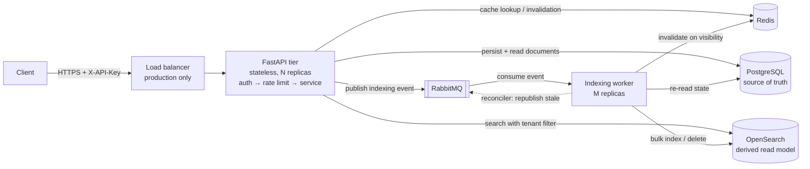

# Distributed Document Search Service — Design & Production Readiness

Submission document for the Software Engineer technical assessment.
Companion artifacts: [`../README.md`](../README.md) (setup, API reference, curl examples, diagrams), [`REQUIREMENTS_MATRIX.md`](REQUIREMENTS_MATRIX.md), [`SELF_AUDIT.md`](SELF_AUDIT.md), [`REVIEWER_NOTES.md`](REVIEWER_NOTES.md).

---

## 1. High-level architecture

Clients reach a stateless FastAPI tier behind a load balancer. Each request is authenticated to a tenant, rate-limited per tenant, then served from Redis or from one of two stores: **PostgreSQL**, the source of truth for tenants and documents, and **OpenSearch**, a derived read model that exists only to answer queries fast. **RabbitMQ** decouples the two: writes commit to Postgres and publish an event; a separate worker tier consumes those events and maintains the index.

The full system, indexing, search, deletion and deployment diagrams — with every arrow labelled — are in [`README.md` §3](../README.md#3-architecture). Every component shown there exists in the code and in `docker-compose.yml`, except the load balancer, which is explicitly marked *production only*.

**Why this shape.** Search traffic and write traffic have different scaling curves, different latency budgets and different failure modes. Putting them on the same store couples them: a bulk import would show up as search p95, and a search spike would contend with writes. Splitting into a transactional store and a derived index, joined by a durable queue, lets each side scale and fail on its own terms. The cost is eventual consistency in search, which §5 states plainly rather than hiding.

## 2. Indexing flow

`POST /documents` → validate → `INSERT` and **commit** in Postgres (`status=pending`, `version=1`) → publish a thin event (`document_id`, `tenant_id`, `version`, `type`) with publisher confirms → invalidate the tenant's search cache → return `202 Accepted`.

The worker consumes with prefetch 200 and batches up to 100 events or 300 ms. It deduplicates by document id keeping the highest version, re-reads current state from Postgres, and issues a single `_bulk` call with `routing=tenant_id` and `version_type=external`. Confirmed documents flip to `status=indexed`, and the worker bumps the tenant's search-cache generation so a query issued during the indexing lag cannot pin an empty result set for a full TTL.

**Why asynchronous.** Bulk indexing and segment refreshes are throughput work with unpredictable latency. Inline indexing would put cluster hiccups directly into the user-visible write path and make ingest spikes fail requests instead of growing a queue.

**Why thin events.** The message carries identifiers, not the document body. Messages stay small, an event can never carry stale content, and replaying an old event re-reads current state — which is what makes the pipeline self-healing.

**Retries and dead letters.** A failed bulk item is nacked without requeue, dead-lettering to `documents.index.retry` (TTL 5 s), which dead-letters back to the main queue. After `MAX_INDEX_ATTEMPTS` (counted from the `x-death` header) the event is published to `documents.index.dlq` and acked, so one poison message cannot block the pipeline. Events for rows that no longer exist, or with malformed ids, are treated as terminal skips rather than retried forever. DLQ depth is an alerting signal, not a silent bin.

**Idempotency and ordering.** RabbitMQ delivery is at-least-once and concurrent consumers break FIFO, so ordering is not assumed. Correctness comes from external versioning instead: OpenSearch rejects any write whose external version is not newer, returning `409`, which the adapter treats as success. A replayed event is a no-op; an out-of-order event loses; a delete (which bumps `version`) can never be undone by an in-flight index event for an older version. Three tests assert exactly this.

**Recovery.** If publishing fails — broker restart, network partition — the row is already committed and the API still returns 202. The reconciler sweeps every 30 s for documents stuck in `pending`/`failed` past a grace period and republishes them. This is a deliberately simple stand-in for a **transactional outbox**, which is the correct production answer: write the row and an outbox record in one transaction and have a relay tail the outbox. The sweep closes the same gap at a fraction of the complexity and is the first thing I would upgrade.

## 3. Search flow

`GET /search` → authenticate → validate the `tenant` parameter against the authenticated principal → rate limit → read the tenant's cache generation → cache lookup → on miss, single-flight to OpenSearch → cache fill with a jittered TTL.

The engine query is a `bool` with the user's text in `must` (`multi_match` over `title^3` and `content`, `operator: and`) and `{"term": {"tenant_id": ...}}` in `filter`. The filter is non-scoring, bitset-cached by OpenSearch, and always present. Query text is passed as a parameter inside the DSL, never concatenated, so hostile input is scored as literal text — a test drives `*`, `" OR 1=1 --` and `content:* AND tenant_id:globex` through the endpoint and asserts the tenant scope is unchanged.

Bonus features are implemented rather than described: `fuzzy=true` applies `fuzziness: AUTO` for typo tolerance, `highlight=true` (default) returns `<em>`-marked fragments, and `facets=true` returns `content_type` and `tags` bucket counts.

## 4. Storage strategy

**PostgreSQL — source of truth.** Two tables. `tenants` holds the tenant id (natural primary key), the SHA-256 of its API key (unique, indexed — the raw key is never stored), status and per-tenant rate limit. Keeping limits in the database rather than in config means a quota change is a row update, not a deploy. `documents` holds a UUID primary key, `tenant_id`, title, content, `content_type`, tags, JSONB metadata, `version`, `status`, and created/updated/indexed/deleted timestamps.

Indexes follow the query patterns and nothing else: `(tenant_id, created_at)` for tenant-scoped listing, `(tenant_id, status)` for per-tenant operational queries, and `(status, updated_at)` for the reconciler sweep. Every repository method takes a `tenant_id` — there is no code path that can read a document without a tenant predicate.

UUID primary keys avoid cross-tenant id guessing and let ids be generated client-side without a round trip; the cost is a wider, non-sequential key, which is acceptable at this row width. Transaction boundaries are narrow: one transaction per write, committed before any external call, so no transaction is ever held open across the network. Connections come from a bounded async pool (`pool_size` 10, overflow 20, `pool_pre_ping`, 30-minute recycle) because `replicas × (pool + overflow)` must stay under Postgres `max_connections` — a connection-pool blowout is one of the most common ways a scaled-out API tier takes down its own database.

Scaling path: PgBouncer in transaction mode, then read replicas for analytics and reconciler sweeps, then `HASH(tenant_id)` partitioning of `documents` past roughly 100M rows so per-partition indexes stay in memory.

**OpenSearch — derived read model.** One index `documents-v1` behind the alias `documents`; the application only ever addresses the alias, which is what makes zero-downtime reindexing possible. Mapping fields: `document_id` and `tenant_id` as `keyword`, `title` as `text` with a `raw` keyword sub-field, `content` as `text`, both using a custom analyzer (standard tokenizer, lowercase, asciifolding, English stop words and stemming), `content_type` and `tags` as `keyword`, `metadata` as a dynamic object with a dynamic template mapping strings to `keyword`, plus `version` and date fields. The root mapping is `dynamic: strict` — an unexpected top-level field is a bug, not an invitation to create a mapping. Uncontrolled mapping growth is a classic way to destabilise a cluster.

Shards and replicas: 3 shards × 1 replica by default. Target 20–40 GB per shard, so 10M documents at ~10 KB each (~100 GB) is roughly 4–6 primaries; replicas scale read throughput and provide failover. `_routing = tenant_id` co-locates a tenant's documents on one shard, turning a fan-out query into a single-shard query — the single biggest lever on tail latency at high QPS. The trade-off is skew: a very large tenant creates a hot shard, and would need its own index or a composite routing key.

Lifecycle and change management: mapping changes that are not backward compatible require a reindex, which is why the alias exists — build `documents-v2`, reindex from `v1`, replay the delta from Postgres, flip the alias atomically, delete `v1`. Postgres being the source of truth means a full rebuild is always possible. ISM policies move cold tenants to warm nodes at scale.

**Redis — cache and coordination.** Search results (~30 s TTL), documents (60 s), tenant/credential lookups (60 s, which keeps authentication off the Postgres hot path), and rate-limit token buckets.

## 5. Consistency model

**This system is eventually consistent between Postgres and OpenSearch, and strongly consistent within Postgres.** Concretely:

| Operation | Guarantee |
|---|---|
| `POST /documents` → `GET /documents/{id}` | **Immediate.** Both hit Postgres. |
| `POST /documents` → `GET /search` | **Eventual**, typically sub-second: publish → consume → batch (≤300 ms) → bulk → refresh (~1 s). |
| `DELETE` → `GET /documents/{id}` | **Immediate.** Soft-deleted in Postgres and the document cache is invalidated synchronously. |
| `DELETE` → `GET /search` | **Eventual**, same pipeline. The window is deliberately short and the API returns only metadata, never content, for index hits. |
| Cached search results | Bounded by TTL *and* by worker-side invalidation, so lag rather than TTL dominates. |

If indexing fails, the document remains `pending` in Postgres, the event retries via the retry queue, and after the attempt limit it lands in the DLQ. The reconciler then republishes it. A document can therefore be temporarily unsearchable, but it is never lost, and the system converges without operator action. The `status` field is not decoration — it is the convergence signal, and it is exposed on `GET /documents/{id}` so a client can see whether a document is searchable yet.

What I am **not** claiming: read-after-write for search. A client that needs it should read `GET /documents/{id}`, or the endpoint could accept an opt-in `?wait_for_indexing=true`. Claiming strong consistency here would be false.

## 6. API design, caching, multi-tenancy, security

**API.** Four required endpoints plus health, readiness, liveness and metrics. Full contracts — headers, bodies, status codes, error cases and tenant behaviour — are in [`README.md` §7](../README.md#7-api-reference), with runnable curl in §8 and a Postman collection at the repository root. Every error uses one envelope carrying `code`, `message`, `request_id` and `details`; `request_id` is echoed as `X-Request-ID` and appears on every correlated log line. Stack traces and driver errors never cross the boundary — the catch-all handler logs the traceback and returns a generic message. `POST` returns `202`, not `201`, because the document is durable but not yet searchable, and the contract should say so.

**Caching.** Three caches, all tenant-scoped by key construction:

| Cache | Key | TTL | Invalidated by |
|---|---|---|---|
| Search results | `t:{tenant}:search:g{gen}:{sha256(query\|page\|size\|flags)}` | ~30 s, jittered | Generation `INCR` on create/delete and on indexing visibility |
| Document | `t:{tenant}:doc:{id}` | 60 s | Deleted directly on delete |
| Tenant credential | `auth:key:{sha256(api_key)}` | 60 s | TTL |

Invalidation uses a **per-tenant generation counter**: bumping `t:{tenant}:search:gen` makes every previously cached key for that tenant unreachable in one `INCR`, with no `SCAN`, no key enumeration and no cross-tenant blast radius. Superseded keys are never read again and expire on their own TTL.

Stampede is handled at two levels: TTLs are jittered ±20% so entries created by one traffic spike do not expire together, and concurrent identical misses are coalesced by an in-process single-flight so only one reaches the cluster. That bounds amplification to the number of API replicas rather than the number of concurrent requests; a Redis-level lock would tighten it further at the cost of a round trip. A test fires 20 simultaneous identical misses and asserts exactly one engine call.

If Redis is unavailable every cache operation is a logged, counted no-op and the request proceeds to the origin. The cache is an optimisation, never a dependency — a test pulls Redis out mid-flight and asserts that search and document reads still return 200.

**Multi-tenancy.** *Identification*: the client sends `X-API-Key`; the service hashes it and resolves the tenant server-side. The `?tenant=` parameter required by the API contract is accepted but treated as an assertion — if it disagrees with the authenticated principal the request is rejected with `403`, never silently re-scoped. In production the same boundary is fed by a validated OIDC access token, with tenant identity read from a trusted claim (`decode_bearer_token_claims` in `core/security.py` marks the seam). *Authorization*: `GET` and `DELETE` resolve documents through tenant-scoped repository methods; a cross-tenant id returns `404` rather than `403`, because a `403` confirms the resource exists. *Data isolation*: every document row carries `tenant_id` and every read is predicated on it. *Search isolation*: the tenant term filter is applied inside the engine query, so other tenants' documents are never in the candidate set. *Cache isolation*: tenant id is part of every key namespace. *Rate-limit isolation*: buckets are keyed `rl:{tenant}:{bucket}`, so limits are per-tenant and one noisy tenant cannot consume another's budget — asserted by a test that exhausts tenant A and shows tenant B unaffected.

The deeper point: isolation is enforced in the layer that does the work, not by convention in handlers. Nothing in the request can widen the scope, because the scope is never read from the request.

**Rate limiting.** Token bucket evaluated atomically in a Redis Lua script — read-modify-write in one round trip, so the limit holds across every replica. Token bucket rather than fixed window because a fixed window lets a tenant spend two windows' worth of quota across a boundary and offers no burst allowance. The clock comes from Redis `TIME`, not the caller, so replica clock skew cannot mint tokens. Separate `search`, `read` and `write` buckets keep a burst of writes from consuming a tenant's search budget. Limits are per-tenant rows in Postgres (default 120/min), so a quota change is a row update. Exceeding the limit returns `429` with `Retry-After` and the standard envelope; successful responses carry `X-RateLimit-Limit` and `X-RateLimit-Remaining`. If Redis is unavailable the limiter degrades to a process-local bucket: protection becomes approximate (up to N× the limit across N replicas) but the service stays up. Failing closed on a cache blip would turn a degradation into an outage. At the edge, a gateway would add IP-level and global limits as a second layer.

**Security.** Implemented in the prototype: credentials stored only as SHA-256 hashes; tenant identity derived server-side; strict input validation with unknown fields rejected and bounded sizes; parameterised database and search queries; `404` instead of `403` on cross-tenant access; identical responses for unknown and disabled keys so there is no enumeration oracle; no stack traces or dependency detail in responses; a health endpoint that reports status without hostnames, versions or connection strings; per-tenant rate limiting against query abuse; a non-root container user; secrets via environment with `.env` git-ignored.

**Explicitly mocked:** API-key authentication stands in for real auth so the prototype runs without an identity provider. In production: OIDC/OAuth2 with JWT access tokens validated against cached, rotated JWKS (`iss`, `aud`, `exp`, `nbf` checked), tenant read from a trusted claim, scope-based authorization for read vs write, short token lifetimes with refresh, mTLS between services inside the mesh, TLS 1.3 terminated at the edge with HSTS, encryption at rest via KMS-managed keys on RDS, EBS and S3 snapshots plus OpenSearch node-to-node encryption, secrets from AWS Secrets Manager or Vault with automated rotation and no secret ever in an image or repository, a WAF for OWASP rules and bot mitigation, per-tenant audit logging of access and deletion, and field-level encryption or a per-tenant CMK where a tenant's data is regulated.

## 7. Production readiness analysis

### Scalability

**100× documents (10M → 1B).** Shard count is the primary lever: at 20–40 GB per shard, 1B documents at ~10 KB is ~10 TB, so roughly 250–500 primaries across dedicated data nodes with hot/warm tiering and ISM moving cold tenants to cheaper storage. Because `_routing = tenant_id` keeps each query on one shard, query latency stays largely independent of total shard count — this is the property that makes the growth path viable rather than merely expensive. Postgres gets `HASH(tenant_id)` partitioning so per-partition indexes stay in memory, with old partitions detached to cold storage under a retention policy. Document bodies move to S3 with Postgres holding metadata and a pointer once average size grows. Reindexing at that scale is a rolling, alias-flipped operation replayed from Postgres, never a big-bang cutover.

**100× traffic (10 → 1000+ QPS).** The API tier is stateless, so throughput scales with replica count behind an HPA driven by p95 latency and CPU. OpenSearch read throughput scales with replica shards — adding replicas is the lever for QPS, adding primaries is the lever for corpus size. Redis absorbs repeat queries, so cluster load grows with *unique* queries rather than total QPS; at very high volume Redis becomes a cluster with per-AZ replicas. Postgres is not on the search path at all, which is deliberate: search scaling never pressures the transactional store. Workers scale on queue depth, independently of query traffic. Backpressure is explicit — ingest spikes become queue depth (observable, alertable, drainable) rather than failed writes, and per-tenant rate limits stop one tenant's burst from consuming shared capacity.

### Resilience

Implemented today: exponential backoff with full jitter on OpenSearch calls (jitter matters — synchronised retries are how a recovering cluster gets knocked over again); a circuit breaker that opens after 5 consecutive failures and half-opens after 10 s, so a dead cluster fails fast instead of holding connections; bounded timeouts on every dependency call including health probes; retry queue plus DLQ for indexing; the reconciliation sweep; fail-open caching; and a degraded-but-serving posture when non-critical dependencies fail.

Per-dependency behaviour is defined rather than emergent: **OpenSearch down** → search returns `503 dependency_unavailable`, writes and document reads continue, documents queue as `pending` and index on recovery. **Postgres down** → writes and document reads fail with `503`, cached searches continue to serve; production adds a Multi-AZ standby with automatic failover. **Redis down** → cold cache, higher latency, degraded-but-bounded rate limiting; `/health` reports `degraded` and stays `200` so the fleet is not drained. **RabbitMQ down** → writes still succeed and commit; events are replayed by the reconciler on recovery. **Worker down** → queue depth grows and alerts fire; on restart consumers drain the backlog, and no data is lost because Postgres already has it.

Production additions: Multi-AZ for every stateful tier, quorum queues for RabbitMQ, PodDisruptionBudgets, graceful shutdown that finishes the in-flight batch before exiting (implemented in the consumer's signal handling), and periodic game-day exercises that kill a data node and a broker under load.

### Security

Covered in §6. Production work, in priority order: replace API keys with OIDC/JWT and scope-based authorization; enable the OpenSearch security plugin with TLS and per-service RBAC; mTLS between services; secrets manager with rotation; WAF and edge rate limiting; per-tenant audit trails; automated dependency and image scanning in CI with signed images; and a documented key-rotation runbook.

### Observability

Implemented: structured JSON logs on stdout, every line carrying `request_id` and `tenant_id`; Prometheus metrics at `/metrics` covering request latency by method/route/status, search latency split by cache vs engine, per-dependency call latency, cache hit/miss/coalesced/error counters, rate-limit outcomes, per-tenant request counts, indexing outcomes, queue publish outcomes, worker batch sizes and circuit-breaker state. Metric labels deliberately exclude tenant id on latency histograms — with thousands of tenants that is a cardinality bomb; per-tenant latency analysis belongs in logs or in exemplars.

Production adds OpenTelemetry tracing with context propagated from the gateway through the API, the queue (trace context in message headers) and the worker, so an indexing lag can be attributed to a specific span rather than guessed at; log shipping to Loki or CloudWatch with per-tenant indexes; and Grafana dashboards per SLO.

**Monitoring the <500 ms p95 target.** `histogram_quantile(0.95, sum(rate(http_request_duration_seconds_bucket{route="/search"}[5m])) by (le))` is the headline SLI, alerted on multi-window burn rate (fast burn: 14.4× over 1 h; slow burn: 6× over 6 h) rather than on a single threshold crossing, which is how you avoid paging on a 30-second blip. Supporting signals: search latency split by cache vs engine (a p95 regression with a stable engine p95 means the cache hit ratio dropped), cache hit ratio, OpenSearch per-shard query latency, queue depth and indexing lag (`now - indexed_at` distribution), DLQ depth (should be zero; any value is an alert), error rate by code, and per-tenant request rates to spot a noisy neighbour before it becomes an incident.

### Performance

Database: bounded pools with PgBouncer, indexes matched to actual access paths, narrow transactions, `EXPLAIN ANALYZE` on every new query pattern, `pg_stat_statements` for regression detection, partitioning at scale. Index management: alias-based zero-downtime reindexing, `refresh_interval` raised during bulk backfills, force-merge on read-only cold indices, ISM for tiering. Query optimisation: single-shard routing, non-scoring filters, `_source` includes, capped `track_total_hits`, bounded page size, `search_after` for deep pagination, and the shard request cache made effective by stable `preference`. Application: async I/O throughout so no request blocks a worker thread on network I/O, and cache-first for repeat queries.

### Operations

Rolling deploys with readiness gating (`/health/ready` fails only on critical dependencies, so a Redis blip does not drain the fleet) and graceful shutdown. **Blue-green** is the pattern for risky changes — most importantly index migrations, where green is `documents-v2` built by reindex, validated against a query corpus, then swapped by an atomic alias flip with the old index retained for instant rollback. Database migrations are expand-contract via Alembic: add nullable, backfill, dual-write, switch reads, drop — never a breaking change in a single release. Backups: Postgres PITR with continuous WAL archiving, 30-day retention and monthly restore drills (an untested backup is not a backup); OpenSearch snapshots to S3, though the real recovery story is that the index is rebuildable from Postgres; Redis needs no backup by design, which is itself a property worth having. Runbooks: DLQ drain, full reindex, tenant offboarding and data erasure, credential rotation, cluster node replacement.

**Cost optimisation:** hot/warm/cold OpenSearch tiering with cold tenants on cheaper storage; reserved or savings-plan capacity for the steady-state baseline with spot instances for workers (interruptible by design — the queue makes that safe); right-sized shards, since over-sharding wastes heap and money; S3 for document bodies with Postgres holding metadata; and the search cache paying for itself directly by reducing the cluster size needed for a given QPS.

### SLA — 99.95% availability

99.95% is ~22 minutes of downtime per month, which is achievable only if partial failures are not outages. The design does that in four ways. **Redundancy:** every tier is multi-AZ — API and worker replicas spread across zones, Postgres Multi-AZ with automatic failover, OpenSearch with 1 primary + 2 replicas per shard across three AZs, Redis with per-AZ replicas, RabbitMQ quorum queues on three nodes. **Failure domain isolation:** an AZ loss removes capacity, not availability; dependency failures degrade specific capabilities rather than the service — the health model encodes exactly which failures are which. **Detection:** SLO burn-rate alerting on the latency and error-rate SLIs, synthetic probes per region exercising the real search path, and DLQ/queue-depth alerts that catch silent data-pipeline failures a health check would miss. **Response:** documented runbooks per failure mode, error-budget-driven release gating (burn the budget, freeze the releases), blameless postmortems with tracked actions, and regular restore and failover drills so recovery is practised rather than improvised. The honest caveat: a single region caps the realistic ceiling — beating 99.95% consistently means multi-region, which is a different cost and consistency conversation.

## 8. Enterprise experience showcase

> **⚠️ PLACEHOLDERS — MUST BE COMPLETED BY THE CANDIDATE BEFORE SUBMISSION.**
>
> I was not given the candidate's professional history, and fabricating systems, metrics or incidents would be dishonest and would collapse under a single follow-up question in the interview. The four sections below are therefore structured prompts, not content. Each shows the shape of a strong Senior/SDE2 answer — situation, technical decision, measured outcome — with the specific facts marked for the candidate to fill in from real experience.
>
> **Guidance:** use real numbers you can defend (if you do not have exact figures, use an honest range and say it is approximate); name the technologies you actually used; describe the trade-off you actually made, including what you gave up; and be ready for "what would you do differently now?", which is asked more often than the question itself.

### 8.1 A similar distributed system you built — scale and impact

**Fill in:** `[SYSTEM NAME AND PURPOSE]` · `[YOUR ROLE AND TEAM SIZE]` · `[STACK]` · `[SCALE: requests/sec, data volume, users, tenants]` · `[BUSINESS IMPACT]`

*Template to adapt:* I [designed / led / contributed to] `[SYSTEM]`, which served `[SCALE]`. The core architectural challenge was `[CHALLENGE — e.g. keeping read latency flat as the corpus grew 10×]`, which I addressed by `[APPROACH]`. I owned `[YOUR SPECIFIC SCOPE — be precise; "I owned the indexing pipeline and its failure handling" is stronger than "I worked on the backend"]`. The system `[MEASURABLE OUTCOME — e.g. sustained X req/s at Y ms p95, enabled Z]`. If I were rebuilding it today I would `[WHAT YOU LEARNED]`.

*Relevance to link explicitly:* the parallels to this assessment — source of truth versus derived read model, asynchronous pipelines, tenant isolation, or whichever genuinely applies.

### 8.2 A performance optimisation with measurable improvement

**Fill in:** `[SYMPTOM AND WHO FELT IT]` · `[HOW YOU MEASURED — profiler, APM, flame graph, EXPLAIN ANALYZE]` · `[ROOT CAUSE]` · `[FIX]` · `[BEFORE → AFTER NUMBERS]` · `[COST OR COMPLEXITY TRADE-OFF]`

*Template to adapt:* `[ENDPOINT/JOB]` was taking `[BEFORE]` at p95, causing `[USER IMPACT]`. Rather than guessing, I `[MEASUREMENT METHOD]` and found `[ROOT CAUSE — e.g. an N+1 query, a missing composite index, an unbounded fan-out, serialisation overhead]`. I fixed it by `[CHANGE]`, taking p95 from `[BEFORE]` to `[AFTER]` and `[SECONDARY BENEFIT — e.g. cutting instance count from N to M]`. The trade-off was `[WHAT GOT MORE COMPLEX]`.

*Strong answers lead with the measurement, not the fix — it shows the optimisation was diagnosed rather than lucky.*

### 8.3 A critical production incident you resolved

**Fill in:** `[WHAT BROKE AND BLAST RADIUS]` · `[HOW IT WAS DETECTED]` · `[YOUR ROLE]` · `[DIAGNOSIS PATH INCLUDING WRONG TURNS]` · `[MITIGATION VS ROOT-CAUSE FIX]` · `[TIME TO MITIGATE]` · `[PREVENTION SHIPPED AFTERWARDS]`

*Template to adapt:* At `[TIME]`, `[SYMPTOM]` affecting `[BLAST RADIUS]`. We detected it via `[ALERT/REPORT]`. I `[YOUR ROLE — incident commander, primary responder, supporting]`. My first hypothesis was `[H1]`, which `[EVIDENCE]` ruled out; the actual cause was `[ROOT CAUSE]`. We mitigated in `[TIME]` by `[MITIGATION]`, then shipped the real fix: `[FIX]`. Afterwards we added `[PREVENTION — alert, circuit breaker, backpressure, runbook, test]`.

*Distinguishing mitigation from root-cause fix is the signal interviewers look for. Including a hypothesis that turned out wrong makes the story credible, not weak.*

### 8.4 An architectural decision balancing competing concerns

**Fill in:** `[DECISION]` · `[COMPETING CONCERNS — e.g. consistency vs availability, speed to market vs maintainability, cost vs latency]` · `[OPTIONS CONSIDERED]` · `[WHAT YOU CHOSE AND WHY]` · `[WHAT YOU GAVE UP]` · `[HOW IT PLAYED OUT]`

*Template to adapt:* We needed `[GOAL]` while `[CONSTRAINT]`. The tension was between `[CONCERN A]` and `[CONCERN B]`. I evaluated `[OPTION 1]`, `[OPTION 2]` and `[OPTION 3]`, and chose `[CHOICE]` because `[REASONING GROUNDED IN THE ACTUAL CONSTRAINTS]`. This meant accepting `[EXPLICIT COST]`, which we mitigated with `[MITIGATION]`. `[TIME LATER]`, the outcome was `[RESULT]` — `[WHAT YOU'D KEEP AND WHAT YOU'D CHANGE]`.

*Name the option you rejected and why. A decision with no discarded alternative reads as a default, not a decision.*

## 9. AI tool usage

AI assistance (Claude) was used on this assessment, as the brief encourages. It contributed to brainstorming architectural options and stress-testing trade-offs, scaffolding boilerplate such as adapter classes and Docker configuration, drafting documentation prose, generating initial test cases, and debugging.

The architecture, technology selection and every trade-off in this document are my own decisions, made against the constraints in the brief and defensible in discussion. All generated code was reviewed, corrected and restructured before inclusion — several AI-suggested approaches were rejected outright, including an initial cache design that invalidated by key enumeration (replaced by the generation-counter scheme), and an event format that carried full document payloads (replaced by thin events with state re-read, which removes the stale-payload failure mode). The test suite was written against the behaviours I wanted to guarantee and was **run**; one run exposed a real design gap — a query issued during the indexing lag could pin an empty result set for a full cache TTL — which led to adding worker-side invalidation after indexing visibility. The self-audit, diagram/code consistency check and reviewer review were performed against the actual repository, not assumed.

AI accelerated the work; it did not make the decisions, and it did not replace verification. Nothing is claimed here that I cannot explain and defend line by line — with the explicit exception of §8, which is marked as placeholders precisely because inventing experience would violate that standard.
